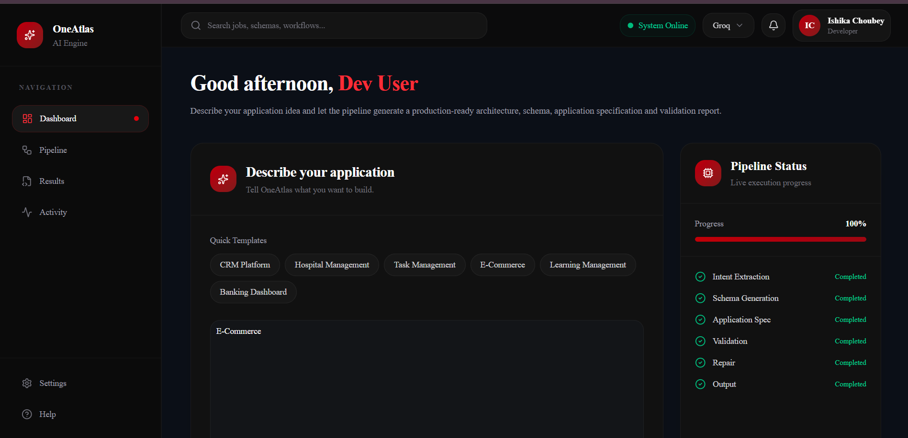
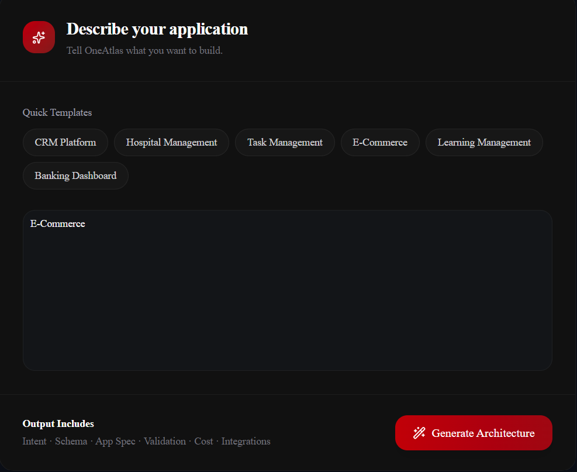
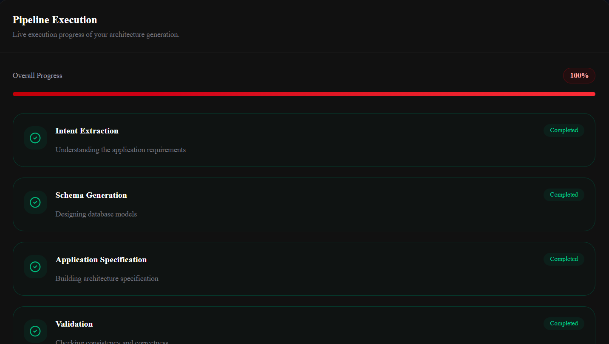
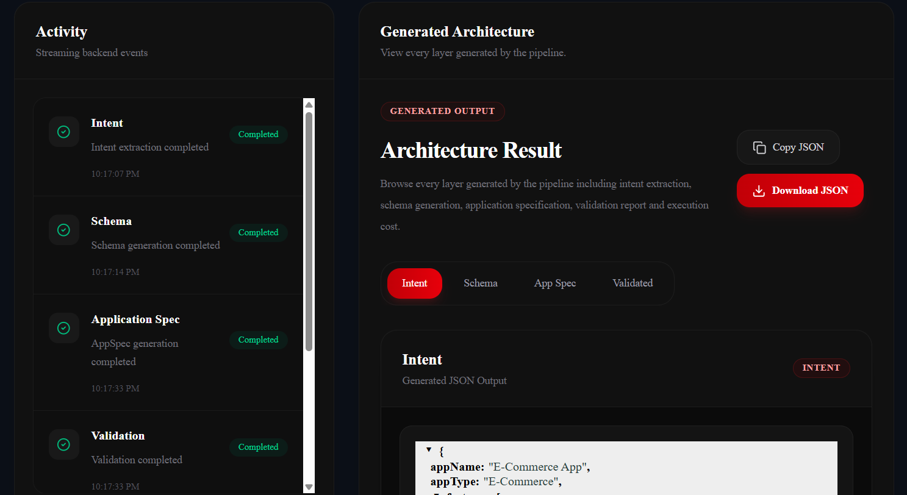
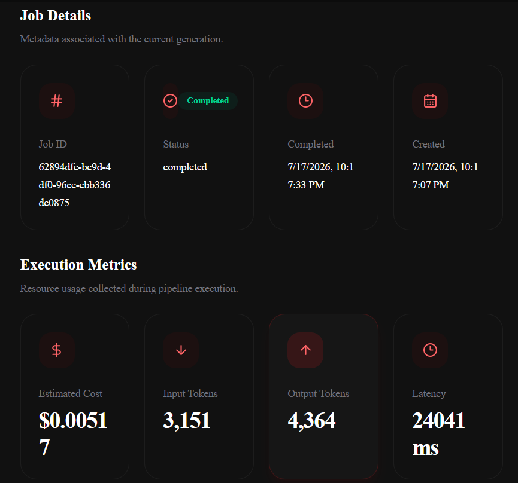
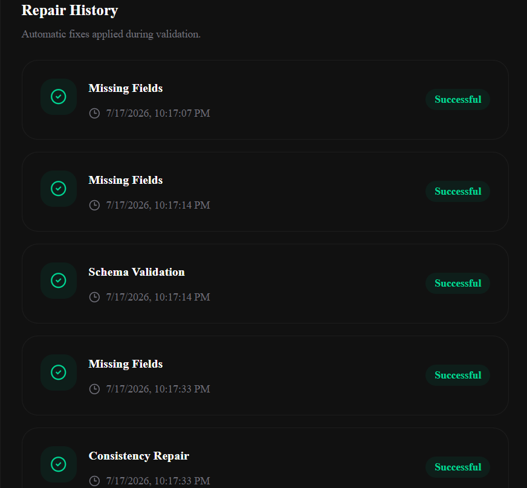

# OneAtlas AI Engine

AI-powered application architecture generator that transforms natural language prompts into validated, production-ready application specifications using a multi-stage LLM pipeline.

The platform combines prompt understanding, schema generation, validation, automated repair, architecture generation, and real-time execution monitoring into a unified developer experience.

---

# Live Demo

### Frontend

https://oneatlas-ai-engine-frontend-git-main-ishika-choubey.vercel.app/

### Backend API

https://oneatlas-ai-engine.onrender.com

---

# Screenshots

## Landing Dashboard



---

## Workspace



---

## Pipeline Execution



---

## Generated Architecture



---

## Cost Analysis



---

## Repair History



---

# Features

## AI Generation Pipeline

The application executes a complete end-to-end workflow consisting of:

- Intent Extraction
- Schema Generation
- Application Specification (AppSpec) Generation
- Validation Engine
- Automated Repair Engine
- Final Output Generation

---

## Multi-Provider LLM Gateway

### Currently Supported Providers

- OpenAI
- Google Gemini
- Groq

### Extensible Provider Architecture

The gateway is designed to support additional providers with minimal configuration.

Implemented provider adapters include:

- Anthropic
- OpenRouter
- DeepSeek
- Google AI
- Mistral

Automatic provider fallback is supported wherever applicable.

---

## Validation Engine

Every pipeline stage is validated before execution proceeds.

Validation includes:

- Required Field Validation
- JSON Structure Validation
- Cross-layer Consistency
- Workflow Verification
- Integration Validation
- AppSpec Validation

---

## Automated Repair Engine

Invalid AI responses are automatically repaired before retrying execution.

Current repair strategies include:

- Missing Field Repair
- JSON Repair
- Schema Validation Repair
- Cross-layer Consistency Repair

Every repair operation is logged and displayed in the dashboard.

---

## Cost Tracking

Each generation records:

- Provider
- Model
- Input Tokens
- Output Tokens
- Total Tokens
- Estimated Cost
- Latency

---

## Live Pipeline Monitoring

Real-time execution updates are streamed using Server-Sent Events (SSE).

The dashboard displays:

- Current Pipeline Stage
- Progress Tracking
- Live Terminal Logs
- Pipeline Status
- Execution Metrics

---

## Integration Registry

Supported integrations include:

- Slack
- Gmail
- Stripe
- Google Drive
- Supabase

Each integration contains:

- Triggers
- Actions
- Workflow Templates

---

## Interactive Dashboard

The frontend provides:

- AI Prompt Workspace
- Live Pipeline Visualization
- Progress Tracking
- Terminal Logs
- Intent Viewer
- Schema Viewer
- AppSpec Viewer
- Validation Reports
- Cost Dashboard
- Repair History
- Copy JSON
- Download JSON

---

# Architecture Overview

```text
                User Prompt
                     │
                     ▼
          Intent Extraction
                     │
                     ▼
           Schema Generation
                     │
                     ▼
          AppSpec Generation
                     │
                     ▼
            Validation Engine
                     │
          ┌──────────┴──────────┐
          │                     │
      Valid                Invalid
          │                     │
          ▼                     ▼
     Final Output        Repair Engine
          │                     │
          └──────────┬──────────┘
                     ▼
             Frontend Dashboard
```

---

# Tech Stack

| Category | Technologies |
|----------|--------------|
| Frontend | Next.js, React, TypeScript, Tailwind CSS v4, Framer Motion, TanStack Query, Radix UI |
| Backend | Node.js, Express, TypeScript |
| AI Providers | OpenAI, Google Gemini, Groq |
| Communication | REST APIs, Server-Sent Events (SSE) |
| Monorepo | TurboRepo, pnpm Workspaces |
| Deployment | Vercel, Render |

---

# Project Structure

```text
oneatlas-ai-engine
│
├── apps
│   ├── backend
│   │   ├── controllers
│   │   ├── gateway
│   │   ├── integrations
│   │   ├── pipeline
│   │   ├── repair
│   │   ├── routes
│   │   ├── sse
│   │   └── utils
│   │
│   └── frontend
│       ├── src
│       │   ├── app
│       │   ├── components
│       │   ├── context
│       │   ├── services
│       │   ├── lib
│       │   └── types
│
├── packages
├── screenshots
├── turbo.json
├── pnpm-workspace.yaml
└── package.json
```

---

# API Endpoints

| Method | Endpoint | Description |
|---------|----------|-------------|
| POST | `/api/v1/generate` | Start AI generation |
| GET | `/api/v1/jobs/:jobId` | Retrieve job status |
| GET | `/api/v1/events/:jobId` | Stream live pipeline events |
| GET | `/api/v1/costs/:jobId` | Cost summary |
| GET | `/api/v1/evaluation/:jobId` | Evaluation report |
| GET | `/api/v1/integrations` | Supported integrations |
| POST | `/api/v1/repair/:jobId` | Execute repair pipeline |

---

# Environment Variables

## Backend

```env
OPENAI_API_KEY=

GROQ_API_KEY=

GEMINI_API_KEY=
```

### Optional Providers

```env
ANTHROPIC_API_KEY=

OPENROUTER_API_KEY=

DEEPSEEK_API_KEY=

GOOGLE_AI_API_KEY=

MISTRAL_API_KEY=
```

## Frontend

```env
NEXT_PUBLIC_API_URL=https://oneatlas-ai-engine.onrender.com/api/v1
```

---

# Installation

Clone the repository

```bash
git clone https://github.com/ishi141/oneatlas-ai-engine.git

cd oneatlas-ai-engine
```

Install dependencies

```bash
pnpm install
```

---

# Running the Project

Run the complete workspace

```bash
pnpm dev
```

Or run applications individually.

### Backend

```bash
pnpm --filter backend dev
```

### Frontend

```bash
pnpm --filter frontend dev
```

---

# Design Decisions

- Modular multi-stage pipeline architecture
- Provider abstraction layer for multiple LLMs
- Validation after every pipeline stage
- Automatic repair before retrying failed generations
- Live execution monitoring using Server-Sent Events
- Independent execution metrics and cost tracking
- Extensible integration registry
- Monorepo architecture powered by TurboRepo

---

# Roadmap

- PostgreSQL persistence
- Redis-backed job queue
- Authentication & User Management
- Docker deployment
- Prompt versioning
- Streaming LLM responses
- PDF export
- Provider benchmarking dashboard
- Execution history
- Saved workflows

---

# License

This project is licensed under the MIT License.

---

# Author

**Ishika Choubey**

GitHub: https://github.com/ishi141

LinkedIn: https://www.linkedin.com/in/ishika-choubey/
